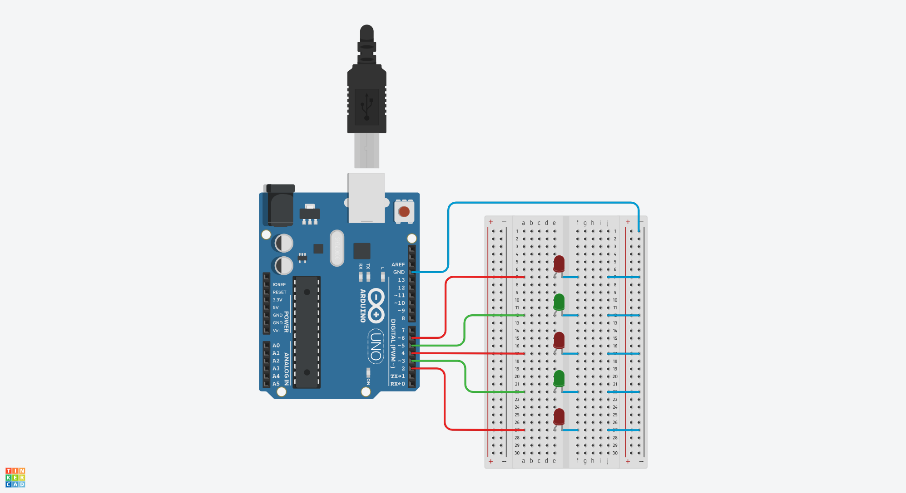

# LED Blinker Project Report

---

## 1. Hardware Circuit Diagram

We use 5 LEDs (3 red and 2 green) and connect the circuit as shown below:



You may find the simulation here:

https://www.tinkercad.com/things/3hiZZPZFm4E-assignment1blinker?sharecode=Ol-TbCMqwtKctloGhUAw2eCyN5i-RfI7IzfyZkhdQOQ

---

## 2. Code

**1. Variable Declaration**

Since we are using the pin headers to control the LEDs, we declare an array to store the pins that will be used to light up the LEDs:

```cpp
const int ledPins[] = {2, 3, 4, 5, 6}; // PIN numbers
const int seq[] = {0, 1, 2, 3, 4, 0, 2, 4, 1, 3}; // Sequence for Criteria 1
const int greenLedPins[] = {3, 5}; // Green LEDs for Criteria 2
const int redLedPins[] = {2, 4, 6}; // Red LEDs for Criteria 3
```

Next, we declare the length of the LED arrays to be used as control parameters for the upcoming `for` loops:

```cpp
const int numLeds = sizeof(ledPins) / sizeof(ledPins[0]);
const int seqLength = sizeof(seq) / sizeof(seq[0]);
```

**2. Function Definition**

**LED Control Handler**

Since we need to consider three elements when controlling the LEDs—the LED array, the array size, and the state of the LEDs—we can create a `void` function that accepts the `ledArray[]` as input and uses a `for` loop to iterate through each PIN. The `for` loop sets the state of each LED using the `digitalWrite()` function based on the `arraySize` and the `state` parameter:

```cpp
void ledControlHandler(const int ledArray[], int arraySize, int state) {
    for (int i = 0; i < arraySize; i++) {
        digitalWrite(ledArray[i], state);
    }
}
```

**Initialization Function**

We set up all the LED pins within the `setup()` function. Since we are using arrays to control the pins, a `for` loop can simplify the code:

```cpp
void setup() {
    Serial.begin(9600);
    for (int i = 0; i < numLeds; i++) {
        pinMode(ledPins[i], OUTPUT);
    }
    pinMode(LED_BUILTIN, OUTPUT);
}
```

**3. Main Program**

**Initialization**

Initially, all pins are set to `LOW` to ensure that no LEDs are left unintentionally turned on:

```cpp
ledControlHandler(ledPins, numLeds, LOW);
```

**[Criteria 1] Light up LEDs in sequence 1 → 2 → 3 → 4 → 5 → 1 → 3 → 5 → 2 → 4**

We use a `for` loop to control the LEDs by passing the corresponding pins to the `ledIndexArray` and executing the `ledControlHandler` function:

```cpp
for (int i = 0; i < seqLength; i++) {
    int ledIndexArray[] = { ledPins[seq[i]] };
    ledControlHandler(ledIndexArray, 1, HIGH);
    delay(1000);
    ledControlHandler(ledIndexArray, 1, LOW);
}
```

**[Criteria 2] Turn off all green LEDs and turn on all red LEDs for one second**

Here, we pass the LED arrays and the number of LEDs to be lit:

```cpp
ledControlHandler(greenLedPins, 2, LOW);
ledControlHandler(redLedPins, 3, HIGH);
delay(1000);
```

**[Criteria 3] Turn off all red LEDs and turn on all green LEDs for one second**

The logic is the same as in [Criteria 2]:

```cpp
ledControlHandler(redLedPins, 3, LOW);
ledControlHandler(greenLedPins, 2, HIGH);
delay(1000);
```

**[Criteria 4] Turn on all 5 LEDs for one second**

We control all LEDs using the `ledPins` array, and the number of LEDs is `numLeds`:

```cpp
ledControlHandler(ledPins, numLeds, HIGH);
delay(1000);
```

**[Criteria 5] Turn off all 5 LEDs for one second**

The logic is the same as in [Criteria 4]:

```cpp
ledControlHandler(ledPins, numLeds, LOW);
delay(1000);
```

---

### Video Demo

The operation video has been uploaded to Google Drive:

[Video Link](https://drive.google.com/file/d/1-8_WchQ6oBqFBo_T2fJ5PeBTvCjLvddX/view?usp=share_link)
